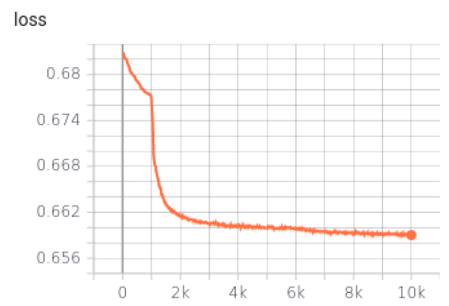
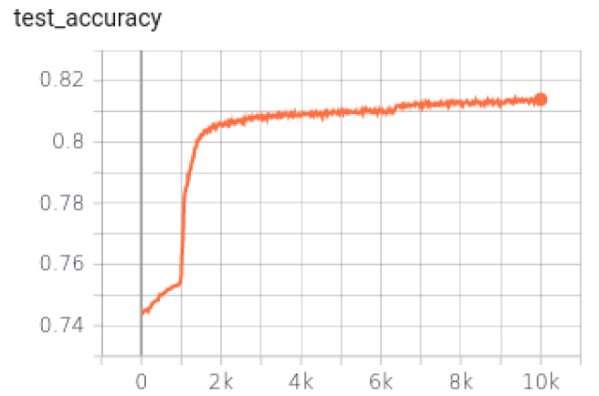

# GNN for node classification 
 This a GNN implementation based on [Pytorch Gemoetric](https://pytorch-geometric.readthedocs.io/en/latest/index.html) for ppi dataset.
 
 ## install required packages 
 
 conda install --file requirements.txt
 
 ## run
 python train.py --path 'pathToDataset'
 
 ## usage 

```
usage: train.py [-h] [--path path] [--dataset dataset] [-a ARCH] [-j N] [-H H]
                [--epochs N] [--valid_steps VN] [-b N] [--lr LR]
                [--num_classes NUM_CLASSES]

GNN based on PyTorch Geometric

optional arguments:
  -h, --help            show this help message and exit
  --path path           path to ppi dataset
  --dataset dataset     Dataset name
  -a ARCH, --arch ARCH  model architecture: GNNStack | SAGENet (default: GNNStack) : SAGENET is not completed
  -j N, --workers N     number of data loading workers (default: 4)
  -H H, --hidden_dim H  dimension of hidden embedding (default: 50)
  --epochs N            number of total epochs to run
  --valid_steps VN      validate every N steps
  -b N, --batch-size N  mini-batch size (default: 1024)
  --lr LR, --learning-rate LR  initial learning rate
  --num_classes NUM_CLASSES number of classes

```
## Training monitoring

tensorboard --logdir log
### Loss

### Validation


### Test Results: 81.68
